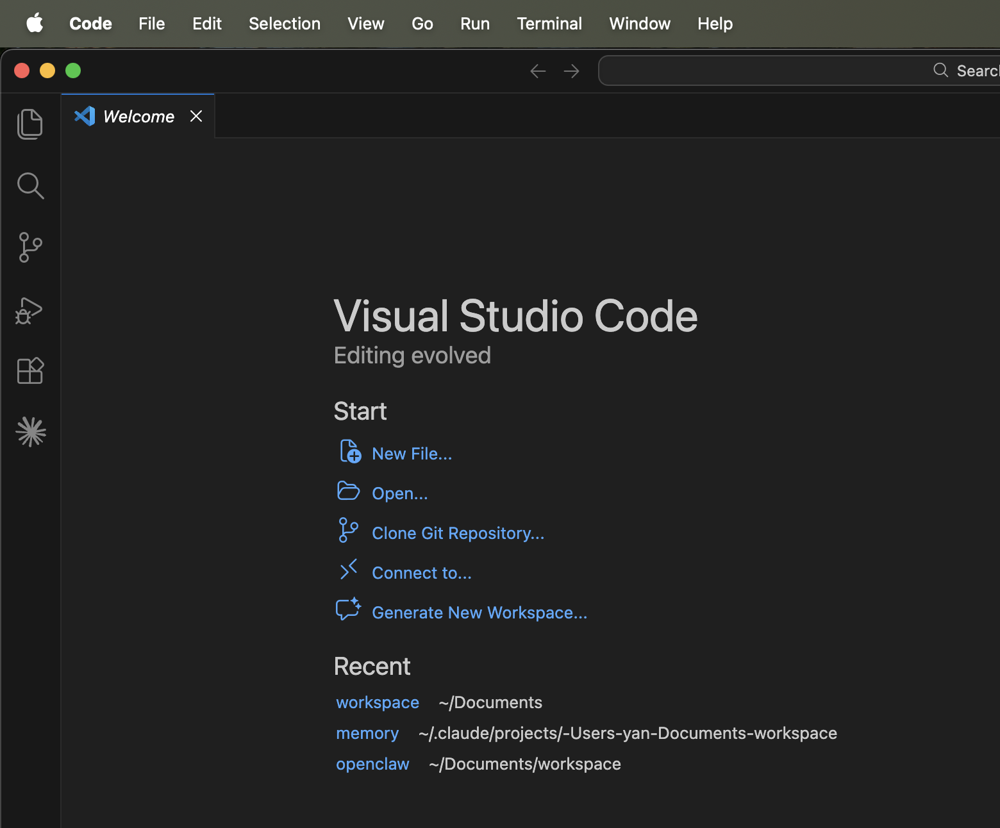
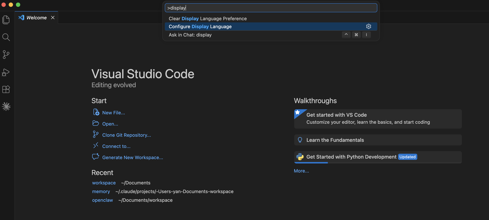
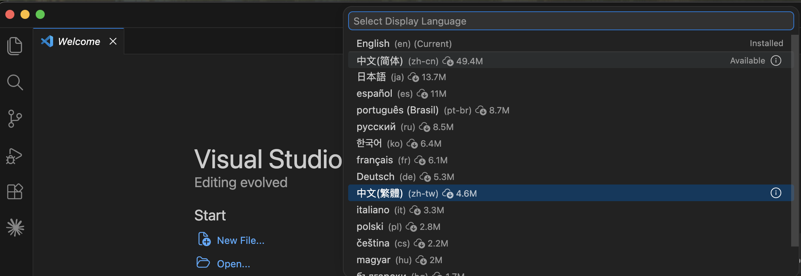
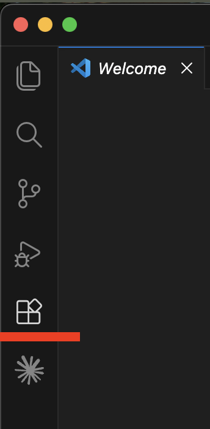
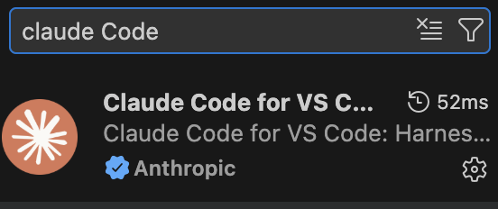
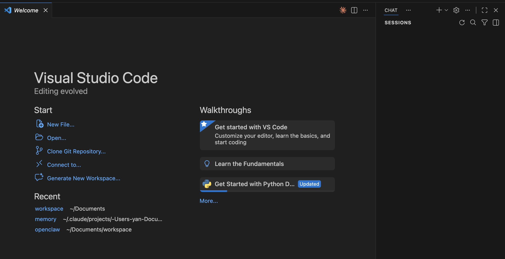
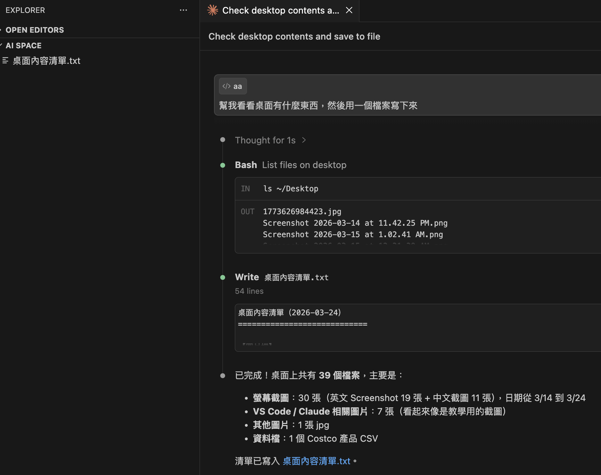

# 第 1 章：從「搬磚工人」到「數位老闆」

## 1.1 數位脂肪：為什麼你的 Gmail 永遠都是滿滿的未讀郵件？

這幾年大家越來越重視體脂肪，每天量體重、算熱量，但很少人注意到自己的數位生活其實更臃腫。你的 Gmail 就像一個從不清理的儲藏室，裡面堆滿了各種「數位脂肪」。

### 數位淤泥：那些你根本不想看的「垃圾」

點開你的 Gmail，最占空間的通常不是重要的文件或是各種租約，而是這些雜七雜八的垃圾：

- **各種登入驗證碼**：半年前為了買張電影票收到的 6 位數驗證碼，現在還躺在那裡佔著位子。
- **不重要的通知**：某個 App 更新了隱私條款、某家餐廳提醒你領取生日優惠，或是社交媒體告訴你「某某某發了新貼文」。
- **各種廣告郵件**：那些你可能這輩子只買過一次，還明確要求不要寄廣告信，卻還是每天寄電子報給你的電商平台。

如果你試過手動整理郵件，肯定知道這是一件多麻煩的事情。你勾選了 50 封廣告郵件點擊「刪除」，發現後面還有 50 封、500 封等著你刪除。你想做自動刪除，又怕刪除了真正重要的郵件；想手動整理分類，發現郵件根本像一座山一樣整理不完。有時候好不容易真的整理完了，結果出國玩了一趟回來，新的一波驗證碼和通知加上各種信件又毀掉你精心整理的郵箱。這就是典型的「搬磚」行為：進行了重複繁雜的動作，去對抗機器自動產生的垃圾，可是最後還是只能乖乖認輸放棄。

## 1.2 請一個數位秘書

本書會介紹如何使用 Claude Code 來改善你日常的工作與生活，這是一款由 Anthropic 出品的 AI 工具，可以直接在你的電腦上執行各種任務，就像你個人的數位秘書一樣。

目前市面上還沒有出現任何免費好用的類似工具可以用。本書以 Claude Pro 訂閱為範例，一個月 20 美金，大約 600 多台幣。付了這筆錢之後，你讀完本書就能從一個「搬磚」的數位工人變成數位老闆，以前自己辛苦做或是根本懶得做的繁雜工作，都可以交給 AI 秘書來處理。

### 把「工作」交代給秘書，把「決定權」留給自己

你不需要成為軟體專家才能享受自動化的便利。你只要把腦子裡的「想法」直接告訴你的數位秘書，剩下的繁瑣設定，通通交給它去打理：

**你的想法**：「幫我把桌面上那堆亂七八糟的截圖、文件、暫存檔分類整理一下，我希望打開桌面的時候可以一眼找到我要的東西。」

**秘書的執行力**：你跟秘書說完，它就會動手整理——把截圖丟到「截圖」資料夾、文件歸到「文件」、用不到的暫存檔直接清掉，幾分鐘後桌面就乾淨了。

## 1.3 網頁版、桌面版的 AI 也很好用啊，為什麼我們還要另外一個 AI？

有些人可能會想：「不對啊，現在 ChatGPT 或是 Gemini 早就可以連結我的 Google 帳號，直接幫我搜尋、整理郵件了，為什麼還要大費周章在電腦上搞一套什麼 AI Agent？」

你想的沒錯，網頁版 AI 確實已經很強大了，但是 Agent 直接提升到另外一個境界，除了雲端的郵件和網站之外，它還可以直接操作你電腦裡面的檔案，自己寫出工作來處理掉你交辦的任務，就像是「遠端顧問」與「隨身特助」的區別。

### 雲端 AI：手伸不進你電腦的「遠端顧問」

你正在用的 AI 其實就是一個遠端顧問，它能幫你分析、給建議、幫你做翻譯，還能翻翻你的電子郵件，但最後一哩路，還是要你自己來，例如它分析完成的文字，你還是要自己動手複製貼上。例如跟 ChatGPT 說：

- **幫我把郵件內容載下來**：它沒辦法做到，只能跟你說怎麼下載、具體操作步驟，可是就是沒辦法把郵件內容存成一個檔案，裡面的附件也一樣只能看不能下載。
- **把客訴郵件分類整理一下再發給對應的負責人**：郵件分類整理能做，可是它不知道分類後有哪些對應的負責人，當然也沒法幫你發信。

### 本機 Agent：AI 不是只能幫你處理 Email

這本書教你裝的 AI Agent（智能體），是住在你電腦裡的，它的威力不僅是上面兩個範例，更在於整套流程的建立與處理：

**數位老闆的真實需求**：「幫我把桌面上那堆亂七八糟的截圖分類一下，找出所有的發票，還有郵件上的發票都抓下來，整理到桌面的「報帳」資料夾，按日期時間順序改好檔名排序，完成再傳 Telegram 訊息給我。」

上面這整套流程，網頁版只能處理一半左右的工作。以下是跟 ChatGPT 的真實對話（AI 的能力一直在進步，下面的限制未來可能會改變，但核心差異不變：網頁版 AI 碰不到你電腦裡的檔案）：

**可以做的部分**

- 分析圖片/截圖內容：你把截圖上傳給我，我可以識別哪些是發票、哪些不是
- 從圖片中擷取發票資訊：日期、金額、店家等欄位都能讀出來
- 規劃檔名命名規則：例如 20260315_1234_全聯.jpg 這類按日期排序的格式
- 整理成清單或表格：幫你列出所有發票的摘要

**做不到的部分**

- 直接存取你的桌面或本機資料夾：我沒有讀寫你電腦檔案系統的能力
- 自動搬移/重新命名本機檔案：這需要在你電腦上執行程式
- 發送 Telegram 訊息：我沒有連接你的 Telegram 帳號

而我們的 AI 秘書住在你的電腦裡，搭配簡單的初期設定，上面這些事情它都能幫你處理。記得前面說的「數位脂肪」嗎？網頁版 AI 頂多幫你看看有多胖，本機 AI 秘書才是真的能拿起減肥刀幫你砍掉這些數位脂肪。

## 1.4 開工準備：把「秘書辦公室」蓋好

既然決定自己當個數位老闆了，我們需要先規劃出一個秘書辦公室讓 AI 秘書可以好好地工作。我們要安裝兩樣東西：VS Code 和 Claude Code。如果你不使用 VS Code 也可以，從 Mac 的終端機或 Windows 的 PowerShell 也能直接使用 Claude Code，但本書後續範例都以 VS Code 為主。

### 第一步：下載並安裝 VS Code

VS Code（Visual Studio Code）是軟體工程師在用的開發工具，不過別緊張，我們只是拿它當秘書的辦公桌，操作起來就像一般的文字編輯器加上聊天軟體。

1. 打開瀏覽器，前往 code.visualstudio.com。
2. 根據你的電腦系統（Windows / Mac）點下載。
3. 安裝過程一路點「下一步」就好。

裝完打開 VS Code，你會看到一個歡迎頁面：



介面還是英文的，想換中文的話，按 Ctrl + Shift + P（Mac 是 Cmd + Shift + P），輸入 display language，選「Configure Display Language」，再選繁體中文就可以了，筆者已經習慣英文介面，就先不切了。





### Windows 用戶：前置準備

Windows 需要先裝好兩樣東西，才能順利安裝和使用 Claude Code。

**1. 安裝 Git for Windows**

Claude Code 的安裝程式需要 Git。到 git-scm.com/downloads/win 下載安裝，過程一路點「Next」就好。裝完可以在 PowerShell 輸入 `git --version` 確認有沒有裝好。

**2. 解鎖 PowerShell 執行原則**

Windows 的 PowerShell 預設不允許執行外部腳本。如果你在下一步安裝 Claude Code 的時候遇到腳本被擋的問題，需要先調整 PowerShell 的執行原則。

打開 PowerShell，輸入：

```
Set-ExecutionPolicy RemoteSigned -Scope CurrentUser
```

系統會問你確不確定，輸入 Y 按 Enter 就好。

這句話的意思是：本機產生的腳本可以直接執行，從網路下載的腳本必須有數位簽章才能跑。Claude Code 幫你寫的腳本都是本機產生的，所以不受影響。同時，如果你不小心從網路下載了來路不明的腳本，系統還是會幫你擋下來。

之後碰到某些腳本被擋住跑不了，可以把 `RemoteSigned` 換成下表中更寬鬆的選項。一般情況下 `RemoteSigned` 就夠用了。

| 模式 | 本機腳本 | 下載的腳本 | 安全性 | 建議 |
|------|---------|-----------|--------|------|
| `RemoteSigned` | ✓ 直接跑 | ✗ 要簽章 | 中高 | 推薦，大多數人用這個就好 |
| `Unrestricted` | ✓ 直接跑 | ⚠ 跳警告 | 中 | 偶爾被擋再考慮 |
| `Bypass` | ✓ 直接跑 | ✓ 直接跑 | 低 | 完全不設防，不建議長期使用 |

按下 Enter 之後，PowerShell 會跳出一段藍底白字的確認訊息，問你「Do you want to change the execution policy?」，下面列了 `[Y] Yes`、`[N] No` 等選項。輸入 `Y` 再按 Enter 就完成了。畫面不會有什麼成功提示，安安靜靜回到 `PS C:\>` 就表示改好了。

**卡關：「這個系統上已停用指令碼執行」**

如果你看到這段紅字，表示 PowerShell 的執行原則還沒改。回到前面的步驟，確認你有執行過 `Set-ExecutionPolicy RemoteSigned -Scope CurrentUser` 並且輸入 Y 確認。如果你用的是 `-Scope CurrentUser`，不需要系統管理員身分也能改；如果你想改全機的原則（不加 `-Scope CurrentUser`），才需要用系統管理員身分開啟 PowerShell。

### Mac 用戶：權限彈窗

Mac 比較簡單一點，終端機預設就能執行大部分操作。不過第一次讓 Claude Code 存取某些資料夾（像是「文件」或「桌面」）時，macOS 會跳出一個小視窗問你「要允許嗎？」，點「允許」就好。

如果之前不小心按了「不允許」，可以到「系統設定 → 隱私與安全性 → 檔案與資料夾」裡面，找到 VS Code 或 Terminal，把權限打開。

進去之後你會看到左邊一排分類，點「隱私與安全性」，右邊找到「檔案與資料夾」，展開就能看到哪些 App 有權限存取哪些資料夾。把 VS Code 或 Terminal 的開關打開就好。

### 第二步：安裝 Claude Code CLI

Claude Code 的核心是一個命令列工具（CLI），我們需要先安裝。官方安裝說明在 code.claude.com/docs/zh-TW/quickstart，跟著以下步驟進行安裝。

1. 打開 VS Code，按 Ctrl + `（Mac 是 Cmd + `）叫出底部的終端機。
2. 在終端機裡貼上安裝指令：

**Mac / Linux：**

```
curl -fsSL https://claude.ai/install.sh | bash
```

**Windows（PowerShell）：**

```
irm https://claude.ai/install.ps1 | iex
```

3. 安裝完成後，先關掉 VS Code 底部的終端機再重新打開（或是整個 VS Code 關掉重開），然後輸入 `claude` 確認安裝成功。如果一切順利，你會看到類似這樣的歡迎畫面：

```
╭─── Claude Code ──────────────────────────────────────────────╮
│                                                │ Recent activity     │
│        Welcome back!                           │ No recent activity  │
│                                                │ ─────────────────── │
│              ▐▛███▜▌                           │ What's new          │
│             ▝▜█████▛▘                          │ ...                 │
│                                                │                     │
│   Claude Pro · your-email@gmail.com            │                     │
│          ~/Documents/AI Space                  │                     │
╰──────────────────────────────────────────────────────────────────╯

❯
```

畫面上會顯示你的 Claude Code 版本、目前使用的 AI 模型、登入的帳號，以及你所在的工作目錄。下方的 `❯` 就是等你輸入指令的地方。版本號和模型名稱會隨更新而改變，跟上面不一樣是正常的。

用這個方式安裝的 Claude Code 會在背景自動更新，你不用擔心版本過期的問題。

**卡關：輸入 claude 卻跳出「command not found」**

安裝程式會把 Claude Code 放在 `~/.local/bin/` 這個資料夾裡，但你的終端機可能還不知道要去那裡找。最簡單的解法就是關掉終端機再重開，讓它重新載入路徑設定。如果重開還是不行，Mac 使用者在終端機裡貼上這行：

```
echo 'export PATH="$HOME/.local/bin:$PATH"' >> ~/.zshrc && source ~/.zshrc
```

Windows 使用者則要手動把安裝路徑加進 PATH。在開始選單搜尋「環境變數」，點「編輯系統環境變數」，會跳出「系統內容」視窗，點右下角的「環境變數」按鈕。在上半部「使用者變數」裡找到 `Path`，點「編輯」→「新增」，貼上 `%USERPROFILE%\.local\bin`，一路按確定關掉。重開終端機，再試一次 `claude` 就行了。

### 第三步：安裝 Claude Code VS Code 插件

CLI 裝好了，接下來裝 VS Code 裡面的插件，這樣你就能在 VS Code 的介面裡跟秘書對話。

1. 點擊左側邊欄長得像「四個方塊」的圖示（Extensions）。



2. 在搜尋框輸入：Claude Code。
3. 認明由 Anthropic 官方出品的那個插件。



4. 點 Install，等它裝完。

### 第四步：建立工作資料夾，用 VS Code 打開

軟體都裝好了，接下來建一個專門給 AI 秘書工作的資料夾。Claude Code 每次啟動時會以 VS Code 目前打開的資料夾作為工作目錄，也就是我們的秘書辦公室了。

1. 在你的電腦上新建一個資料夾，例如 Windows 上的 `C:\AI Space`，Mac 上的 `~/Documents/AI Space`（打開 Finder，進到「文件」資料夾，新建一個叫 AI Space 的資料夾）。
2. 回到 VS Code，點左上角「File」→「Open Folder」（Mac 是「File」→「Open Folder...」），選剛才建好的 AI Space 資料夾，點「Open」。
3. VS Code 可能會跳出一個視窗問你「Do you trust the authors of the files in this folder?」，點「Yes, I trust the authors」就好。

現在 VS Code 左側的檔案總管會顯示 AI Space（目前是空的），底部終端機的路徑也會切到這個資料夾。之後所有跟 AI 秘書的對話和它產生的檔案，都會在這裡面。



打開後你可能會看到中間有個 Welcome 分頁，先不用管它。點左側邊欄的 Claude 圖示（一個米字形的 ✱ 符號），打開 Claude Code 的對話面板。如果左側看不到，也可以找右下角狀態列的「✱ Claude Code」點進去。

### 第五步：登入你的 Claude 帳號

點開左側的 Claude 圖示後，面板會自動提示你登入。點下去之後瀏覽器會跳出 Anthropic 的登入頁面，用你的 Claude Pro（或 Max）帳號完成登入就好。登入成功後瀏覽器會顯示確認訊息，回到 VS Code 你就會看到 Claude Code 的對話框已經可以輸入了。

登入資訊會存在你的電腦裡，之後不用每次都重新登入。如果需要切換帳號，在對話框裡輸入 `/login` 就行。

工具裝好了，帳號也連上了。現在你的秘書已經就位，準備開工，這時候可以把剛才打開的 Terminal 跟右邊的 Chat 關掉，讓畫面更乾淨一些。

## 1.5 你的第一次對話：讓秘書產生一個檔案

秘書裝好了，來試試看它到底能不能動。現在你的 AI Space 資料夾還是空的，我們就讓秘書在裡面生一個檔案出來。

在 Claude Code 的對話框裡輸入：

```
幫我看看桌面有什麼東西，然後用一個檔案寫下來
```

秘書收到指令之後，它會先告訴你它打算怎麼做，然後問你要不要讓它執行。



這裡 Claude Code 會跳出一個權限確認，問你要不要讓它執行。你會看到三個選項：

- **Allow**：允許這次執行，下次遇到類似動作還是會再問你。
- **Always allow**：允許這次，而且以後同類型的動作都自動放行，不再問你。
- **Deny**：拒絕，不讓它執行。

第一次用的話，先選 **Allow** 就好，一個一個確認比較安心。後面我們再介紹一下這些令人頭痛的權限管理。

按下 Allow 之後，秘書會先跑去看你桌面上有什麼檔案，然後自動整理成一份清單，存成 `桌面內容清單.txt`。你會看到左側的檔案總管裡多了這個檔案，點開來看，裡面分門別類列出了你桌面上的所有東西。

就這樣，你的 AI 秘書剛剛真的碰到了你電腦裡的東西，還幫你整理好了。這只是開始，秘書已經就位，下一章馬上讓它處理三個實用的小場景。
