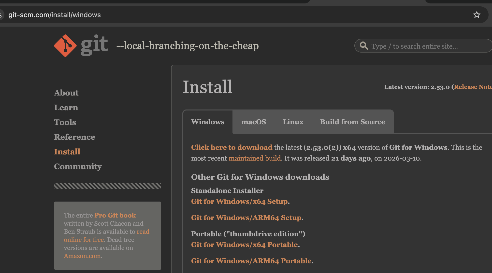
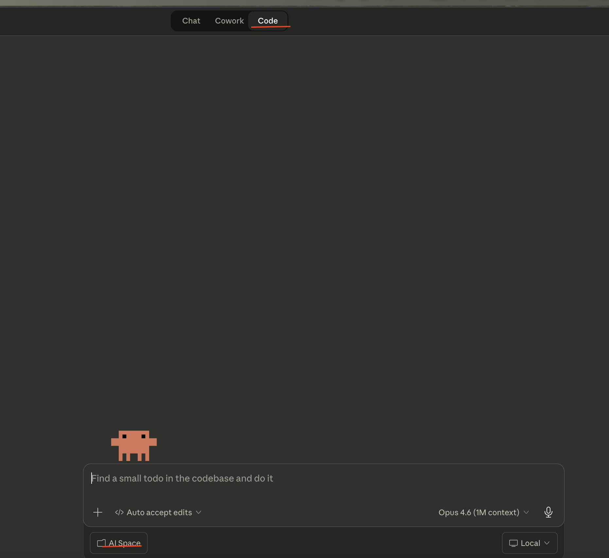
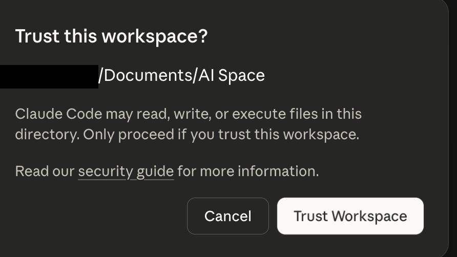
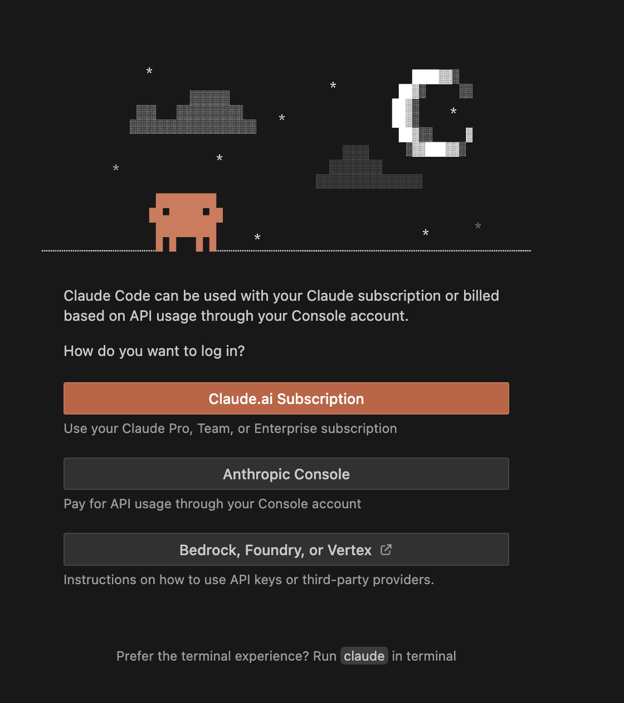

# 第 1 章：自己當老闆：請個 AI 秘書

## 1.1 那些你每個月都在重複做的苦差事

信箱裡躺著幾百封未讀信件？下載資料夾堆滿了累積好幾年的 PDF 和過期截圖？在這個資訊過載的時代，數位雜物正以驚人的速度佔據你的生活。這些雜物清理起來不難，但是又覺得不值得花這麼多時間處理，我們先看下以下典型的例子：

1. 數位垃圾場：手機相簿裡的 2 萬張照片中，混雜著停車場樓層照、外送截圖和菜單翻拍，想找一張旅行照片得翻半天。
2. 月底的規律體力活：手動下載信用卡帳單、截圖存檔、再一筆筆輸入 Excel。
3. 文件跳轉地獄：寫報告時要在三個 Word 和兩份 PDF 之間來回切換找數據；或是對著一小時的會議錄音，枯燥地打逐字稿。
4. 量大就崩潰的重複動作：客戶要求 30 份不同規格的報價單，你只能不停地複製、貼上、改檔名。

這些事情的共同點是：處理起來高重複性、耗時而且枯燥無聊，可是。它們不值得親自動手，卻又不會自動消失。

## 1.2 請一個數位秘書

本書主要的目標是讓每個人都可以透過 Claude Code 這款由 Anthropic 出品的 AI 工具來過過當老闆的癮，Claude Code 是可以直接在你的電腦上執行各種任務，是屬於你的 AI 秘書。目前市面上還沒有免費好用的類似工具可以用。本書以 Claude Pro 訂閱為範例，一個月 大約 20 美金， 600 多台幣。這就是我們當老闆的給初級秘書的每月薪資了，付了這筆錢之後，再好好的看完本書，就能搖身一變成為數位老闆，隨時指派 AI 處理上一節這些繁雜無趣的工作。

Anthropic 另外還有 Max 方案，月費大約 100 到 200 美金，能用上最強的 Opus 模型，額度也高很多。聽起來很誘人，但 Pro 方案搭配的 Sonnet 模型處理本書教的所有任務綽綽有餘，多數人根本用不到 Opus 那種等級的火力。錢省下來買咖啡比較實在，真的覺得不夠力再升級就好。

### 把「工作」交代給秘書，把「決定權」留給自己

不需要成為軟體專家或是寫程式高手才能享受自動化的便利。只要把腦子裡的「想法」直接告訴數位秘書，剩下的繁瑣設定，通通交給它去打理：

**你的想法**：「幫我把桌面上那堆亂七八糟的截圖、文件、暫存檔分類整理一下，我希望打開桌面的時候可以一眼找到我要的東西。」

**秘書的執行力**：你跟秘書說完，它就會去動手：把截圖丟到「截圖」資料夾、文件歸到「文件」、用不到的暫存檔直接清掉，幾分鐘後桌面就乾淨了。

## 1.3 網頁版、桌面版的 AI 也很好用啊，為什麼我們還要另外一個 AI？

有些人可能會想：「不對啊，現在 ChatGPT 或是 Gemini 早就可以連結我的 Google 帳號，直接幫我搜尋、整理郵件，甚至用 Gemini 直連 Gmail 寫信也行，為什麼我還要大費周章在電腦上搞一套什麼 AI Agent？」

你想的沒錯，網頁版 AI 確實很聰明，只可惜它的聰明被困在瀏覽器裡。當你需要處理電腦裡的檔案時，它除了在螢幕上給你一堆建議，剩下的跑腿工作還是得你自己動手。這就像是只會出一張嘴的「遠端顧問」，跟真正幫你把事情做完的「隨身特助」的區別。

### 雲端 AI：手伸不進你電腦的「遠端顧問」

你正在用的網頁版 AI 定位是一個遠端顧問。它能幫你分析重點、做翻譯，甚至還能看看雲端的電子郵件。但最後一哩路它走不出去，這顧問就是只能讓你問，動手的部分還是要靠自己，文字要自己複製貼上，寫出來的網頁要自己存下來。舉個具體的例子，當你跟 ChatGPT 說：

- **幫我把這封信的內容和附件載下來**：它會熱心地吐出一份落落長的「下載教學」要你照著步驟走，但因為他無法讀取你的硬碟，所以最後你還是要自己動手下載。
- **把客訴整理好，轉發給對應的部門主管**：它可以漂亮地幫你分類郵件，做出精美的表格，但如果要寄出去？抱歉，請你自己開啟信箱，把內容貼進去，排版，然後勾選要寄送的名單再寄送。

### 本機 Agent：AI 不是只能幫你處理 Email

這本書教你裝的 AI Agent（智能體），是住在你電腦裡的 AI，它的能力不僅是上面兩個範例，更厲害的是它可以建立與處理整套的工作流程：

**數位老闆的真實需求**：「幫我把桌面上那堆亂七八糟的截圖分類一下，找出所有的發票，還有郵件上的發票都抓下來，整理到桌面的「報帳」資料夾，按日期時間順序改好檔名排序，完成再傳訊息給我。」

上面這整套流程，網頁版只能處理一半左右的工作。以下是跟 ChatGPT 的真實對話（AI 的能力一直在進步，下面的限制未來可能會改變，但核心差異不變：網頁版 AI 碰不到你電腦裡的檔案）：

**可以做的部分**

- 分析圖片/截圖內容：把截圖上傳給它，它可以識別哪些是發票、哪些不是
- 從圖片中擷取發票資訊：日期、金額、店家等欄位都能讀出來
- 規劃檔名命名規則：例如 20260315_1234_躺平科技.jpg 這類按日期排序的格式
- 整理成清單或表格：幫你列出所有發票的摘要

**做不到的部分**

- 直接存取你的桌面或本機資料夾：它沒有讀寫你電腦檔案系統的能力
- 自動搬移/重新命名本機檔案：這需要在你電腦上執行程式
- 發送訊息：它沒有連接你的通訊軟體，例如Line, Telegram

而我們的 AI 秘書住在你的電腦裡，搭配簡單的初期設定，這一整套的事情都能全部交給 AI 秘書自行處理，我們翹著腳再麻煩等結果就可ㄧ。

## 1.4 開工準備：把「秘書辦公室」蓋好

既然決定自己當個數位老闆了，我們來把秘書請進電腦裡。只需要安裝一樣東西：Claude Desktop。

### 第一步：下載並安裝 Claude Desktop

1. 打開瀏覽器，前往 `https://claude.ai/download`。
2. 根據電腦系統（Windows / Mac）點下載。
3. Mac：打開下載的 `.dmg` 檔案，把 Claude 拖進「應用程式」資料夾。Windows：執行下載的 `.exe` 安裝檔，一路點「下一步」。

裝完打開 Claude，你會看到登入畫面。

### Windows 用戶：安裝 Git

Windows 需要額外裝一個東西才能讓 Claude Desktop 正常運作。

Git 原本是程式設計師用來做版本管理的工具，我們先不管這玩意到底是幹嘛用的。但 Claude Desktop 在 Windows 上需要借用 Git 裡面附帶的一個環境來執行指令，沒有它就跑不起來。

到 `https://git-scm.com/downloads/win` 下載安裝檔。git-scm.com 是 Git 的官方網站，全世界幾千萬開發者都從這裡下載，可以放心裝。



點「Click here to download」下載安裝檔，執行後一路按 Next 就好，所有選項都保持預設。

**安裝卡關的萬用解法**

Windows 的安裝問題五花八門。如果碰到錯誤訊息，把紅字整段複製，貼到網頁版的 Claude（claude.ai）或 ChatGPT 問它怎麼解，通常幾秒鐘就能拿到答案。畢竟正在裝的就是這位秘書本人，請它幫忙排除安裝問題，也是很合情合理。

### Mac 用戶：權限彈窗

Mac 比較簡單，不需要額外安裝任何東西。不過第一次讓 Claude Desktop 存取某些資料夾（像是「文件」或「桌面」）時，macOS 會跳出一個小視窗問你「要允許嗎？」，點「允許」就好。

如果之前不小心按了「不允許」，可以到「系統設定 → 隱私與安全性 → 檔案與資料夾」裡面，找到 Claude，把權限打開。

### 第二步：登入你的 Claude 帳號

打開 Claude Desktop，用 Claude Pro（或 Max）帳號登入。登入成功後會看到 Claude 的主畫面，上方有三個分頁：**Chat**、**Code** 和 **Cowork**。

- **Chat**：一般的 AI 對話，跟網頁版 claude.ai 功能一樣。
- **Code**：這才是我們的秘書辦公室。秘書可以讀寫檔案，還能執行指令、安裝工具、寫腳本、串接外部服務、設定排程，是三種模式裡最強大的，整本書教的都在這個分頁。
- **Cowork**：也能讀寫檔案、整理資料夾、製作文件，介面更直覺，但它不能執行指令或跑腳本。要批次處理幾千張照片的時候，Code 可以寫一個腳本幾分鐘跑完，Cowork 只能讓 AI 一張一張看，token 很快就燒光了。

點 **Code** 分頁，這就是我們接下來整本書會用的地方。



登入資訊會存在電腦裡，之後不用每次都重新登入。

### 第三步：建立工作資料夾

軟體裝好了，接下來建一個專門給 AI 秘書工作的資料夾。

在電腦上新建一個資料夾，例如 Windows 上的 `C:\AI Space`，Mac 上的話打開 Finder，進到「文件」資料夾，新建一個叫 AI Space 的資料夾。

### 第四步：開啟第一個對話

在 Code 分頁裡，會看到一個 **Select folder** 的按鈕。點下去，選剛才建好的 AI Space 資料夾。

前面那張圖的左下角可以看到目前選的工作資料夾（圖中顯示「AI Space」），點它就能切換到其他資料夾。

選好之後，Claude Desktop 就會以這個資料夾作為秘書的工作目錄。之後所有跟 AI 秘書的對話和它產生的檔案，都會在這裡面。每次點左上角的 `New session` 開新對話時都可以重新選資料夾，一個對話對應一個資料夾，現在秘書已經就位，準備開工。

## 1.5 你的第一次對話：讓秘書產生一個檔案

秘書到職了，我們馬上派個小任務試試它的身手。現在 AI Space 資料夾還是空的，直接讓秘書在裡面生一個檔案出來。在對話框裡輸入：

```
幫我看看桌面有什麼東西，然後用一個檔案寫下來
```

第一次開啟對話時，Claude 會先問你是否信任這個工作資料夾，因為接下來它會在裡面讀寫檔案。點 **Trust Workspace** 就好。



秘書收到指令之後，它會先告訴你它打算怎麼做，然後問你要不要讓它執行。


這裡 Claude Code 會跳出一個權限確認，問要不要讓它執行。會看到三個選項：

- **Allow**：允許這次執行，下次遇到類似動作還是會再問你。
- **Always allow**：允許這次，而且以後同類型的動作都自動放行，不再問你。
- **Deny**：拒絕，不讓它執行。

第一次用的話，先選 **Allow** 就好，一個一個確認比較安心。後面我們再介紹一下這些令人頭痛的權限管理。

按下 Allow 之後，秘書會先跑去看桌面上有什麼檔案，然後自動整理成一份清單，存成 `桌面內容清單.txt`。打開 AI Space 資料夾就能看到這個檔案，裡面分門別類列出了你桌面上的所有東西，如果你的秘書不是產生`txt`而是`md`黨，不用擔心，先把`md`檔當作一般的純文字文件用就可ㄧ。

打開 AI Space 資料夾就能看到它做的桌面內容清單。之後秘書產生的所有檔案都會在這裡面，隨時可以用 Finder（Mac）或檔案總管（Windows）來查看。

這只是第一步，秘書已經準備開工，下一章馬上讓它處理三個實用的小場景，以下是補充內容，跳過沒關係。


### 進階選項：用 VS Code 當秘書辦公室

本書用 Claude Desktop 示範，但如果你有寫程式的習慣，或是想看看工程師都怎麼使用Claude Code，可以考慮搭配 VS Code（Visual Studio Code）使用。VS Code 是軟體工程師最主流的開發工具之一，Claude Code 有官方的 VS Code 插件。

VS Code 多了什麼：

- **左列檔案列表**：左邊直接看到整個資料夾結構，點開就能編輯，不用另外開 Finder 或檔案總管翻來翻去
- **內建終端機**：可以自己手動跑指令，不一定什麼事都要經過 AI
- **程式碼排版**：腳本和設定檔看起來有顏色標記，比純文字容易閱讀
- **Git 整合**：版本管理，每一版改了什麼、改了幾行，一目了然

以下是完整安裝步驟，不需要的話可以跳過，後面用 Claude Desktop 一樣能做所有操作。

**第一步：下載並安裝 VS Code**

1. 打開瀏覽器，前往 `https://code.visualstudio.com`。
2. 根據電腦系統（Windows / Mac）點下載。
3. 安裝過程一路點「下一步」就好。

裝完打開 VS Code，會看到一個歡迎頁面：


介面還是英文的，想換中文的話，按 Ctrl + Shift + P（Mac 是 Cmd + Shift + P），輸入 display language，選「Configure Display Language」，再選繁體中文就可以了。


**第二步：安裝 Claude Code CLI**

Claude Code 的核心是一個命令列工具（CLI），需要先裝好它，VS Code 插件才能運作。

1. 打開 VS Code，按 Ctrl + `（Mac 是 Cmd + `）叫出底部的終端機。
2. 在終端機裡貼上安裝指令：

**Mac / Linux：**

```
curl -fsSL https://claude.ai/install.sh | bash
```

**Windows（PowerShell）：**

```
irm https://claude.ai/install.ps1 | iex
```

3. 安裝完成後，先關掉 VS Code 底部的終端機再重新打開（或是整個 VS Code 關掉重開），然後輸入 `claude` 確認安裝成功。第一次啟動會跳出登入畫面，選「Claude.ai Subscription」用你的 Pro 帳號登入：



登入成功後，會看到類似這樣的歡迎畫面：

```
╭─── Claude Code ──────────────────────────────────────────────╮
│                                                │ Recent activity     │
│        Welcome back!                           │ No recent activity  │
│                                                │ ─────────────────── │
│              ▐▛███▜▌                           │ What's new          │
│             ▝▜█████▛▘                          │ ...                 │
│                                                │                     │
│   Claude Pro · your-email@gmail.com            │                     │
│          ~/Documents/AI Space                  │                     │
╰──────────────────────────────────────────────────────────────────╯

❯
```

畫面上會顯示 Claude Code 版本、目前使用的 AI 模型、登入的帳號，以及所在的工作目錄。版本號和模型名稱會隨更新而改變，跟上面不一樣是正常的。透過這個指令安裝的 Claude Code 會在背景自動更新，往後不需要再擔心版本過期。

**Windows 用戶：解鎖 PowerShell 執行原則**

Windows 的 PowerShell 預設不允許執行外部腳本。如果安裝 Claude Code 時遇到腳本被擋的問題，需要先調整執行原則。打開 PowerShell，輸入：

```
Set-ExecutionPolicy RemoteSigned -Scope CurrentUser
```

系統會問你確不確定，輸入 Y 按 Enter 就好。這句話的意思是：本機產生的腳本可以直接執行，從網路下載的腳本必須有數位簽章才能跑。

| 模式 | 本機腳本 | 下載的腳本 | 安全性 | 建議 |
|------|---------|-----------|--------|------|
| `RemoteSigned` | ✓ 直接跑 | ✗ 要簽章 | 中高 | 推薦，大多數人用這個就好 |
| `Unrestricted` | ✓ 直接跑 | ⚠ 跳警告 | 中 | 偶爾被擋再考慮 |
| `Bypass` | ✓ 直接跑 | ✓ 直接跑 | 低 | 完全不設防，不建議長期使用 |

**卡關：輸入 claude 卻跳出「command not found」**

安裝程式會把 Claude Code 放在 `~/.local/bin/` 這個資料夾裡，但終端機可能還不知道要去那裡找。最簡單的解法就是關掉終端機再重開，讓它重新載入路徑設定。如果重開還是不行，Mac 使用者在終端機裡貼上這行：

```
echo 'export PATH="$HOME/.local/bin:$PATH"' >> ~/.zshrc && source ~/.zshrc
```

Windows 使用者則要手動把安裝路徑加進 PATH。在開始選單搜尋「環境變數」，點「編輯系統環境變數」，會跳出「系統內容」視窗，點右下角的「環境變數」按鈕。在上半部「使用者變數」裡找到 `Path`，點「編輯」→「新增」，貼上 `%USERPROFILE%\.local\bin`，一路按確定關掉。重開終端機，再試一次 `claude` 就行了。

**第三步：安裝 Claude Code VS Code 插件**

CLI 裝好了，接下來裝 VS Code 裡面的插件，這樣就能在 VS Code 的介面裡跟秘書對話。

1. 點擊左側邊欄長得像「四個方塊」的圖示（Extensions）。


2. 在搜尋框輸入：Claude Code。
3. 認明由 Anthropic 官方出品的那個插件。


4. 點 Install，等它裝完。

裝完後用 VS Code 打開之前建好的 AI Space 資料夾（File → Open Folder），就能在右側的 Claude Code 面板跟秘書對話，左邊同時看到資料夾結構：


功能跟 Claude Desktop 的 Code 分頁完全一樣。本書後續所有操作在 Claude Desktop 和 VS Code 裡都能做，不影響學習。
