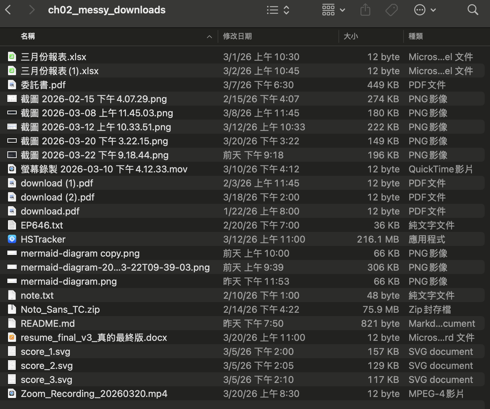

# 第 2 章：秘書上工了

先下載本書的測試資料，解壓縮後把整個資料夾丟到 AI Space 裡面：

- **GitHub**：到 `https://github.com/yanyanclaw/useful-claude-code-materials`，點綠色的「Code」按鈕，選「Download ZIP」。
- **Google Drive**：<!-- TODO: 上傳完補連結 -->

下載完解壓縮，把裡面的 `測試素材` 資料夾整個拖進 AI Space。完成之後，AI Space 裡面應該會有一個 `測試素材` 資料夾，裡面裝了之後幾章測試用的各種檔案。

打開電腦的「下載」資料夾，看看那堆累積了好幾年不知道是什麼東西的截圖、十幾個叫做「最終版」的履歷，還有各種不知名的解壓縮包，是時候讓秘書幫我們整理一下了。

這章我們先拿 `測試素材` 裡的 `ch02_downloads` 來練手，這是一組模擬的「下載資料夾」，裡面塞了截圖、PDF、試算表、影片、錄音等各種常見檔案，就跟平常下載資料夾裡會看到的垃圾差不多。用測試資料練習，不用拿自己的檔案冒險。

裡面是簡易版的下載資料夾，裡面應該有這些東西：五張截圖（檔名是日期亂碼）、三份叫 download.pdf 的不明文件、某份叫「resume_final_v3_真的最終版.docx」的履歷、重複的報表、兩段錄影（一段 Zoom、一段螢幕錄製），還有幾張根本不知道幹嘛用的 SVG 圖檔。



### 關於權限確認

接下來的操作過程中，Claude Code 會不斷跳出權限確認，跟前面一樣先都按 **Allow** 就好。

### 任務一，下載資料夾整理

我們先來試試 AI 秘書的能力，看看它能不能做分類還有改檔名。在 Claude Code 對話框輸入：
```
你在哪個資料夾
```
秘書會回答它目前的工作目錄，確認是 AI Space。如果不是，點左上角 New session 開新對話，重新選 AI Space 資料夾。接著輸入：
```
幫我整理 測試素材/ch02_downloads 資料夾。把檔案按類型分到子資料夾，然後看一下截圖的內容，幫它們取有意義的檔名。先列出你打算怎麼改讓我確認，不要直接改動。
```

注意最後一句：「先列出來讓我確認，不要直接改動」。這是跟各種 AI 合作的好習慣。身為謹慎的老闆，總是先讓秘書做報告，看完再決定執行。

按下 Enter，Claude Code 會先掃一眼資料夾裡有什麼檔案，然後一張一張打開截圖看內容。分類這件事電腦本來就會做，但「看圖片內容來取名字」才是 AI 秘書的真本事。

等它看完所有檔案，會列出一份完整的整理方案，包含資料夾分類和截圖改名建議：

```
資料夾分類：
  圖片/     - 所有 .png 和 .svg
  文件/     - .pdf, .docx, .xlsx, .txt
  影音/     - .mp4, .mov
  壓縮檔/   - .zip
  應用程式/ - .app

截圖重新命名：
  截圖 2026-02-15 下午4.07.29.png → GitBook定價頁面.png
  截圖 2026-03-08 上午11.45.03.png → GitHub_financial-services-plugins_repo.png
  截圖 2026-03-12 上午10.33.51.png → Google試算表_每月支出記帳.png
  ...
確認後我再動手。
```

它真的看懂了每張截圖的內容：有一張是 GitBook 的定價頁面、有一張是 Google 試算表的記帳表、還有一張是 Claude Code 自己在整理檔案的終端畫面。這些名字不是亂取的，是我們的秘書看了圖片內容之後再寫出檔名。

看一眼清單，覺得沒問題就回覆「OK」、「好」、「沒問題」之類的確認用語，它就會自動建好子資料夾、搬移檔案、重新命名，一氣呵成。完成後打開 AI Space 資料夾就能看到整整齊齊的資料夾結構。如果你想復原剛才的動作，只要跟它說一句「幫我還原剛才的操作」。

### 常見狀況

**貼大量文字進去，畫面只顯示一行標記**

有時候你複製一大段文字貼進對話框，畫面上不會展開全文，只會顯示類似 `[pasted content: 2,847 chars]` 的一行標記。別擔心，AI 讀得到完整內容，只是介面沒有展開顯示而已。不要以為它沒收到就重貼一次，那不只是浪費你的時間，還會消耗秘書的 token。

**「它把我的檔案搬不見了！」**

別慌。Claude Code 在搬移檔案之前通常會用 `mv` 指令，檔案只是從 A 搬到 B，不會消失。如果你找不到某個檔案，先去那些新建的子資料夾裡找。真的找不到，可以在同一個對話裡問它：「你剛剛把 XXX 檔案搬到哪了？」在同一個對話裡，秘書都可以輕鬆地還原這些操作。

**Claude Code Token 用量限制**

Claude Code 做任何事情都要消耗 token，可以想像成秘書的體力值。每 5 小時根據不同方案有一定的額度，用完秘書就直接罷工，要等額度恢復才能繼續。不會多扣錢，但除了加錢之外，就只能等秘書的體力值恢復。

省額度的小技巧：一件事做完之後，左上點`New Session` 開一個新的對話再開始下一件事。因為 Claude Code 每次回覆時，都會把整段對話歷史重新讀一遍，對話越長，每次消耗的額度就越多。所以不要在同一個對話裡從整理資料夾聊到寫腳本再聊到改文件，做完一件事就開新對話，額度可以用更久。如果不想開新對話，也可以在對話框輸入 `/clear` 清掉歷史紀錄，不過之前的對話就沒辦法保留。

## 2.2 任務二 匯率追蹤

你是不是也整天盯著日圓匯率，想趁便宜多換一點，結果每天的日常就是手動打開銀行網頁、按重新整理，像個機器人一樣重複這種毫無成就感的事？或者是每天聽朋友在群組裡抱怨這類訊息：

「上禮拜換了 0.22，今天看到 0.215，心痛到睡不著。」

「現在是低點嗎？還是會再跌？求大神分析！」

「換太早了，少吃兩塊和牛。」

我們讓我們的秘書幫你追蹤日圓匯率，然後幫你用專業的角度分析你現在該不該買。

### 動手做：讓 Claude Code 自動追蹤

在對話框打 `/new` 開一個新的對話，讓秘書重新整理一下，回到全新的狀態開始處理新任務。

> 跑腳本需要 Python，如果你的電腦還沒裝，秘書會發現然後告訴你怎麼裝，照它的提示做就好。

在 Claude Code 對話框輸入：

```
幫我寫一個腳本，每天查日圓匯率，記錄下來，然後跟最近幾天比一比，告訴我現在算高還是低。
```

就這樣，不用指定要用什麼語言、不用告訴它去哪裡抓資料、不用說明需要什麼格式。我們當老闆，就是先出一張嘴，員工再自己想辦法搞定任務。

Claude Code 收到指令後會自己去找匯率資料來源，然後寫出一個完整的 Python 腳本。寫完之後它通常會直接跑一次，確認能正常運作。

跑完之後你會看到類似這樣的輸出：

```
正在查詢日圓匯率... (2026-03-24)
✅ JPY/TWD: 0.2052

資料不足，需要至少 2 天的紀錄才能比較。繼續每天執行就會累積資料！
```

第一天跑只有一筆資料，沒辦法比較高低，這很正常。但我們不想等一個月才看到分析結果，直接在同一個對話裡接著說：

```
你先去補一下最近的歷史資料，我年底要去日本滑雪，幫我判斷現在適不適合買日圓。
```

秘書會自己想辦法把半年份的歷史資料補回來，然後產出完整的分析報告：

```
==================================================
📊 日圓匯率分析報告
==================================================
今日匯率: 0.2052 TWD/JPY
（換算：1 萬日圓 ≈ NT$2,052）

📈 近 30 天統計：
   最低: 0.2036  最高: 0.2091  平均: 0.2053
   今日排在近期的第 63 百分位

💡 判斷: 🟠 略高於平均，可以再觀望
   ↗️ 近 5 天趨勢：上升中（日圓變貴）
==================================================
```

它還會根據「年底要去滑雪」這個資訊，給出具體的換匯建議：還有八九個月，不用急著一次 all-in，可以每個月分批換一些攤平匯率風險，如果跌到 0.2030 以下就是近半年低點，可以多換一些。

這就是 AI 秘書跟單純查匯率網站的差別。網站只給你一個數字，秘書給你一份有歷史脈絡、有趨勢分析、還針對你個人情境的判斷報告。

但誰有空每個月跑一次銀行臨櫃換日圓？時間成本也是成本。AI 秘書又沒有雙腳可以幫我們去換匯，讓我們請它改進一下：

```
分批換也太麻煩了吧，時間成本也是成本啊
```

秘書馬上換策略：幫你在腳本裡設一個目標價 0.2030（近半年低點區間），每次跑的時候自動比對，到價就用大大的字告訴你「現在可以買了」。目前還是要自己記得跑腳本，但後面的章節會教怎麼讓電腦每天自動跑，到價還能發通知到手機。

### 

回頭看剛才發生了什麼。我們打了三段對話，每次都讓這個功能升級了。

第一次，秘書寫好腳本，跑一次就能看到今天的匯率。第二次，你叫它補歷史資料，腳本有了分析判斷的能力。第三次，你嫌麻煩，它幫你加上目標價比對，跑的時候直接告訴你該不該買。

其實如果一開始就可以把需求說清楚是最好的，例如說「幫我寫一個查日圓匯率的腳本，要能獲取歷史資料，根據現價分析現在適合換日圓嗎」，秘書一次就能做到位，不用來回三趟。不過老闆只是有個想法，細節都還沒想好也是很正常的。


### 常見狀況

**「跑腳本的時候噴了一堆紅字」**

最常見的原因是 Python 套件沒裝好。把錯誤訊息直接貼給 Claude Code，它會幫你裝好缺少的套件。

**「抓到的匯率是空的」**

秘書用的匯率資料來源偶爾會改版或維護，腳本就抓不到資料。把錯誤訊息丟給 Claude Code，跟它說「匯率資料抓不到了，幫我看看腳本要怎麼修」，它會自己換一個資料來源或修好腳本。另外，週末和國定假日部分資料來源不更新，腳本可能會抓到空值，這不是 bug。

## 2.3 任務三：找出沒拍好的照片

接著我們來試試照片整理的功能，抓出那些重複、失焦、還有各種原因沒拍好，早該刪除的照片。一樣先開一個新的對話。

### 任務三 刪除廢照片

我們準備了 5 張 Gemini 產生的假照片，在 `測試素材/ch02_images`，馬上來試試。在對話框輸入：

```
幫我看下裡面的照片 測試素材/ch02_images
```

秘書會先列出資料夾裡有什麼，然後逐張讀取：

```
這個資料夾共有 5 張圖片，以下是內容說明：

圖片         描述
image1.jpg   山谷風景照 - 從高處俯瞰被群山環繞的山谷，有河流蜿蜒，天空多雲。畫面清晰。
image2.jpg   與 image1 完全相同的照片，看起來是重複的。
image3.jpg   同一場景，但整張照片模糊（類似高斯模糊）。
image4.jpg   同一山谷背景，但畫面前景被一顆彩色大球體遮擋。
image5.jpg   類似 image4，也有彩色球體遮擋，拍攝角度略不同。
```

看完之後，接著跟它說：

```
幫我刪掉被遮擋、重複還有失焦的照片
```

秘書不會直接動手，而是先列出它打算刪什麼，問你確認：

```
根據分析，需要刪除的照片：

- image2.jpg - 與 image1 重複
- image3.jpg - 整張失焦模糊
- image4.jpg - 被彩色球體遮擋
- image5.jpg - 被彩色球體遮擋

刪除後只保留 image1.jpg（清晰的原始山谷風景照）。確認要刪除嗎？
```

回覆「ok」，它才會執行刪除，最後資料夾裡只剩下 image1.jpg。

看起來很厲害對吧？它真的能判斷照片的品質和內容，而且刪除前一定會先問你。

### 可是，幾百張照片你的秘書就直接罷工了

5 張照片對我們的秘書來說是小意思。但是如果你把出國玩拍的兩千張照片一口氣塞給它看？ 很快你就會發現，AI 秘書的「體力值」（Token）是有上限的。一張圖大約會花費一千多個 Token，兩千張照片看下來，它很快就會碰到Token用量的天花板，直接兩手一攤罷工休息。

用昂貴的 AI 模型一張張去看無聊的失敗截圖，就像花時薪三千請了個頂級精算師，卻叫他幫你你星巴克排今天的買一送一，完全是浪費資源，所以我們先拿幾張照片體驗一下 AI 秘書的能力就好，千萬別一口氣把整個相簿塞給它。怎麼處理大量照片又不把 Token 燒光，後面的章節再來解決。